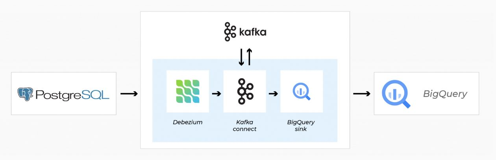
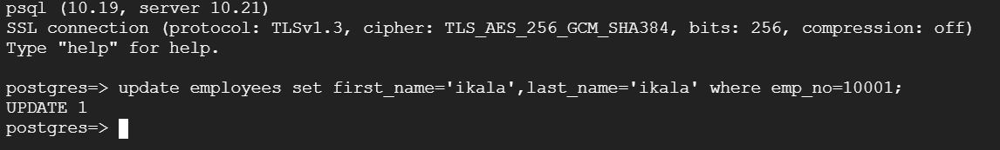
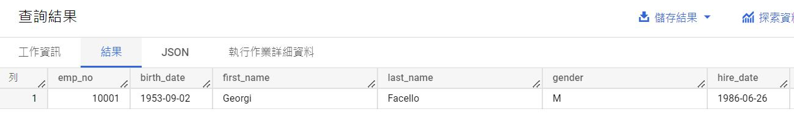
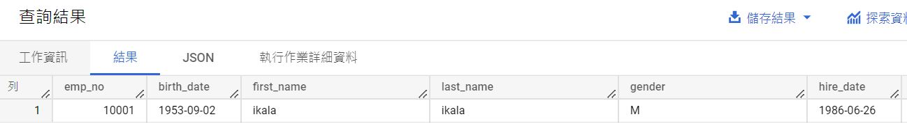

# Overview



# PostgreSQL

- Archive Mode has enabled
```
show archive_mode;
```

- wal_level parameter is already logical
```
show wal_level;
```

- Change user role
```
ALTER USER postgres WITH REPLICATION;
```

- Restore Dump File
```
pg_restore -C -c -d postgres -h 172.30.3.8 -U postgres -W employees.dump
```

# BigQuery

- Create BigQuery DataSet
```
bq --location=US mk -d pg2bq
```

# Kafak

- Build Kafka Connect
```
docker build . -t pg2bq-connect
```

- Create GCP credencial
```
kubectl create secret generic creds --from-file=key.json=key.json
```

- Clone Kafka charts
```
git clone https://github.com/confluentinc/cp-helm-charts
```

- Deploy Kafka 
```
helm install confluent cp-helm-charts -f value.yaml
```

# Kafak Connect

- Expose kafak connect
```
kubectl patch svc confluent-cp-kafka-connect -p '{"spec":{"type":"LoadBalancer"}}'
```

### Debezium PostgreSQL CDC Source Connector

- Create Postgres Connector
```
curl -s -X POST -H 'Content-Type: application/json' --data @postgres-connect.json http://35.192.81.119:8083/connectors
```

- Check Postgres Connector status
```
curl http://35.192.81.119:8083/connectors/postgres-connect/status
```

### Google BigQuery Sink Connector

- Create BigQuery Connector
```
curl -s -X POST -H 'Content-Type: application/json' --data @kcbq-connect.json http://35.192.81.119:8083/connectors
```

- Check BigQuery Connector status
```
curl http://35.192.81.119:8083/connectors/kcbq-connect/status
```

# Result

- PostgreSQL Update Data



- BigQuery Before



- BigQuery After

